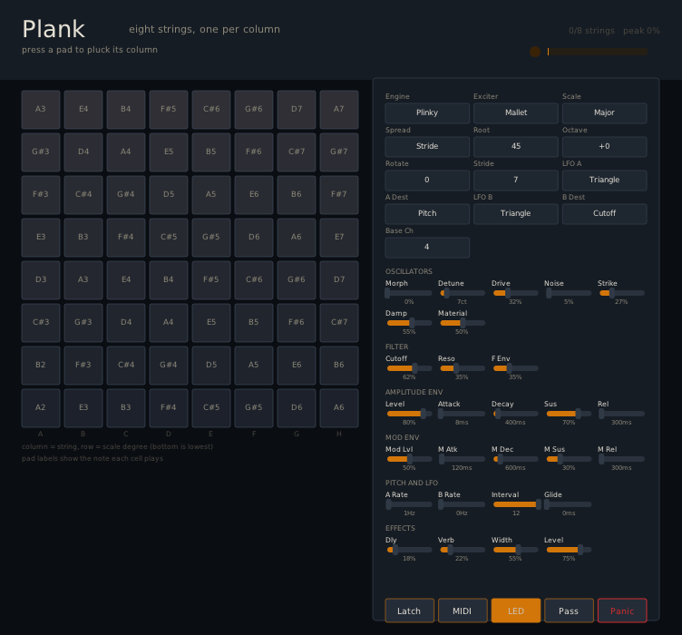

# Plank

`Plank` is an eight-voice polyphonic synthesizer played from a Novation
Launchpad's 8 x 8 grid. Each column of the grid is one monophonic voice and each
row is a degree of the current scale, so up to eight notes sound at once, one per
column.

A voice can be one of two kinds of sound, chosen with `Engine`:

- **A subtractive wavetable voice** taken from [Plinky](https://plinkysynth.com):
  an oscillator pair that morphs through seventeen band-limited wavetables into a
  resonant lowpass filter, with two envelopes and two LFOs.
- **A struck resonator**, modelled on the Intellijel/AAS Plonk Eurorack module: a
  mallet or noise burst excites a bank of resonant modes tuned like a bar,
  marimba, drumhead, membrane, plate or string, for pitched and unpitched
  percussion.

Both feed the same delay, reverb, stereo width and output stage.

Plinky calls its eight voices "strings", because on that instrument each is a
touch strip you slide a finger along. Plank keeps the word for the columns, but
only the `String` engine actually sounds like one. Holding six pads gives six
voices, each keeping its own pitch and timbre.

## The interface



The window has three areas: the pad grid on the left, the control panel on the
right, and a header strip across the top.

### Header

Shows how many strings are currently sounding (`n/8 strings`) and an output peak
meter.

### Pad grid

An 8 x 8 grid that mirrors the Launchpad. **Columns are strings** (labelled A to
H underneath) and **rows are scale degrees**, with the bottom row the lowest.

- Click a pad to pluck that string at that pitch; click a sounding pad again to
  release it. The same cell on a connected Launchpad does
  the same thing, and each plays what the other shows.
- **Every pad is labelled with the note it plays** (for example `A3`, `E4`), so
  the layout can be read straight off the grid whatever the tuning. Move `Root`,
  `Scale`, `Spread` or `Stride` and the labels follow.
- A sounding string lights its column in green, yellow, orange and red as its
  level rises, the same ramp the Launchpad LEDs use.
- A column is one string and sounds one note at a time. On the Launchpad,
  pressing another row in a sounding column re-strikes the string at the new
  pitch.

### Selectors

Click a selector to step to its next value; it wraps at the end.

| Selector | What it does |
|---|---|
| `Engine` | Sound source: `Plinky` wavetable voice, or a resonator model (`Beam`, `Marimba`, `Drumhead`, `Membrane`, `Plate`, `String`) |
| `Exciter` | What strikes the resonator: `Mallet` or `Noise`. Only used by the resonator engines |
| `Scale` | The scale the rows climb through |
| `Spread` | How the eight strings are tuned against each other (see below) |
| `Root` | MIDI note of row 0 on the first string (45 is A2) |
| `Octave` | Shifts the whole grid by octaves |
| `Rotate` | Slides which scale degree sits under row 0, in scale steps |
| `Stride` | Semitones between neighbouring strings. Only used when `Spread` is `Stride` |
| `LFO A` / `LFO B` | Shape of each low-frequency oscillator |
| `A Dest` / `B Dest` | What each LFO modulates: pitch, cutoff, morph, noise or drive |
| `Base Ch` | MIDI channel for the optional note output |

### Sliders

Click or drag along a track. The value is shown underneath.

- **Oscillators**: `Morph` blends the polyBLEP oscillator pair into the
  wavetables (on the resonator engines it becomes the exciter hardness).
  `Detune` separates the oscillator pair in cents, `Drive` adds saturation and
  `Noise` mixes in noise. `Strike`, `Damp` and `Material` shape the resonator
  engines and do nothing on `Plinky`.
- **Filter**: `Cutoff`, `Reso` and `F Env`, how far the mod envelope opens the
  filter on each pluck.
- **Amplitude env**: `Level`, `Attack`, `Decay`, `Sus`, `Rel`.
- **Mod env**: the same five controls for the second envelope, which opens the
  filter by the `F Env` amount.
- **Pitch and LFO**: LFO `A Rate` and `B Rate`, `Interval` (the second
  oscillator's offset, 12 is an octave) and `Glide`.
- **Effects**: delay send (`Dly`), reverb send (`Verb`), stereo `Width` and master
  `Level`.

### Buttons

`Latch` holds strings after release, `MIDI` sends the played notes out, `LED`
turns Launchpad feedback on or off, `Pass` lets unhandled input MIDI through, and
`Panic` stops everything, resets the strings and clears the Launchpad.

### Tuning the strings: `Spread`

| Spread | Column *c* is tuned |
|---|---|
| `Stride` (default) | Plinky's rule: *c* x `Stride` semitones above column 0, snapped to the nearest degree of the scale. The default stride of 7 gives strings roughly a fifth apart that never leave the key |
| `Scale` | *c* scale degrees above column 0, so the grid is a two-octave scale surface and holding a row plays a cluster |
| `Fourths` | *c* perfect fourths above column 0, the classic guitar stack |
| `Fifths` | *c* perfect fifths above column 0 |
| `Unison` | every column shares column 0's ladder |

`Fourths` and `Fifths` are exact intervals and can leave the scale; `Stride`
always stays in it. Set `Stride` to 0 for unison.

### Playing the resonator engines

Choose an `Engine` other than `Plinky` and each pluck strikes a bank of eight
resonant modes, in the manner of the Intellijel/AAS Plonk module. A good starting
point is `Marimba` with `Mallet`, then:

- `Morph` for a soft or hard mallet (or a dull or bright noise burst);
- `Strike` to move the strike point along the object (the centre sounds hollow,
  near the edge it sounds thin and bright);
- `Damp` for how long the object rings, from a dead thud to several seconds;
- `Material` from wood and skin (upper modes die fast) to glass and metal (they
  ring on).

The filter, envelopes and effects still apply, so a long `Rel` lets a struck
note tail off naturally.

## Launchpad Controls

A diagram of the whole surface, with what every button does and every LED colour,
is in [docs/layout.md](docs/layout.md).

The grid uses Novation programmer-mode note numbers, where note `11` is the
bottom-left cell and note `88` is the top-right cell. Row 0 is the bottom
hardware row, matching the `padseq` reference described in
[docs/launchpad.md](../../docs/launchpad.md).

Top-row buttons:

- `91`: octave down
- `92`: octave up
- `93`: morph down
- `94`: morph up
- `95`: latch on/off
- `96`: drive up
- `97`: resonance up
- `98`: LED feedback on/off
- `99`: panic; stop every string, re-enter programmer mode, clear the LEDs

Side buttons `19` through `89` select a performance scale: Chromatic, Major,
Minor, Dorian, Mixolydian, Pentatonic Major, Blues, Whole Tone.

## MIDI Mapping

Musical MIDI is optional and off by default. With `MIDI` enabled, plucking a pad
emits a note-on for the row's pitch and releasing it emits a note-off, on
`Base Channel`. The default base channel is `4`, because Launchpad programmer-mode
LED updates use MIDI channels 1-3 for static, flashing and pulsing colours.

`Pass` is off by default, so unrecognised controller input does not leak
downstream. Enable it only when you intend unhandled input MIDI to continue.

## LED Mapping

Grid LEDs use the static programmer-mode channel. Each string's cells take a
level ramp so a held note is visible across its column, and the cell currently
sounding reads white:

- silent: off
- low: green
- rising: yellow
- high: orange
- very high: red
- struck cell: white

Side buttons show the selected scale in pink, the rest dim. Top buttons are
coloured by action group, with latch lit yellow while on, and the logo/panic
button red. The LED button itself stays dim whether feedback is on or off.

`Panic` sends the same programmer-mode SysEx used by the `padseq` LV2 plugin,
then a bulk Launchpad LED clear message covering the grid, side buttons and top
buttons, followed by ordinary three-byte LED-off messages. The ordinary messages
are there because some VST3 hosts filter SysEx.

## Sound

The engine is a reimplementation of Plinky's voice architecture in portable C++,
not a port of its Cortex-M4 code:

- two 32-bit phase oscillators, summed as a polyBLEP saw pair with the second
  inverted, which is what hollows the tone out as `Interval` shrinks;
- `Morph` blending that pair into seventeen band-limited wavetables read at a
  quarter-cycle offset;
- Plinky's two-pole resonant filter, driven by the second envelope;
- two attack/decay/sustain/release envelopes;
- Cytomic-style dynamic parameter smoothing;
- a tape-style delay, a shimmer reverb, mid/side width and a soft output stage.

The `Spread` and `Engine` controls are described under [The interface](#the-interface).

`docs/scales.md` is the reference for the scale list and its ordinals.

See [docs/design.md](docs/design.md) for implementation notes, including where
Plank deliberately departs from Plinky.

## Host compatibility

The core has no audio I/O of its own beyond rendering. The DPF/VST3 wrapper
declares two stereo outputs, zero inputs, MIDI in and out, and requests host
time position so the delay can follow the tempo.

## Saving and restoring

Plank's patch is stored as a single versioned text state keyed by parameter
symbol, so it is human-readable in a project file and adding or reordering
parameters later cannot invalidate an existing project:

```
version=1
morph=0.770000
scale=16.000000
root=55.000000
...
```

Opening a project restores the sound settings, the tuning, the LFO routing and
the LED/MIDI/latch switches. Two things are deliberately **not** saved: the 64
grid cells, because restoring them would re-pluck every string on load, and the
panic trigger, because restoring a value of 1 would fire it. A state naming
either is skipped rather than rejected, so a hand-edited file cannot make the
plugin start making noise.

The state is versioned, and it refuses unknown parameter names and unknown
version numbers outright rather than half-applying them, so loading a state
from an incompatible build leaves the current patch untouched.
