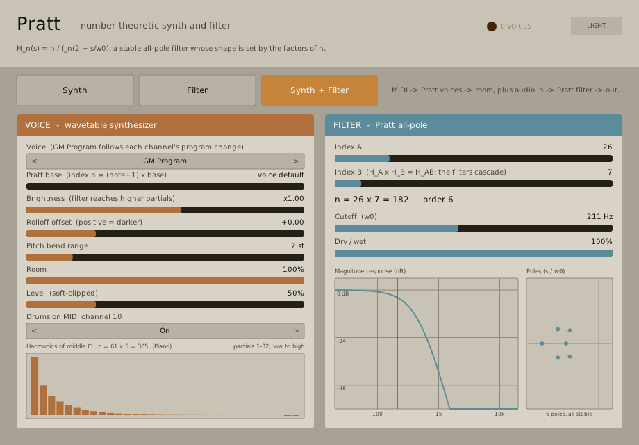

# Pratt

A number-theoretic synthesizer and filter. Both halves are built from the Pratt
polynomials `f_n` (`f_p = 1 + f_{p-1}` for odd primes, multiplicative otherwise,
`f_n(2) = n`) and the stable all-pole filter `H_n(s) = n / f_n(2 + s/w0)`.

Ported from the offline renderer in `~/github/pratt-synth`.



| Mode | Signal |
|---|---|
| Synth | MIDI -> Pratt voices -> room -> out (audio input ignored) |
| Filter | audio in -> Pratt filter -> out (MIDI ignored) |
| Synth + Filter | MIDI -> voices -> room, plus audio in, then the Pratt filter |

- **Voices:** eleven families (piano, electric piano, organ, pluck, bass, strings,
  brass, reed, flute, pad, timpani) following General MIDI programs, or fixed. The
  spectrum of each note comes from `H_n` with `n = (note + 1) x base`, so timbre
  shifts irregularly across the keyboard with the factorisation of `n`.
- **Filter:** `n = A x B` (two cascading index controls, `H_A H_B = H_AB`), cutoff
  and dry/wet. The panel plots the magnitude response and the poles.
- 64 voices, sustain pedal, volume/expression/pan, pitch bend, channel-10 drums.

## Build

Part of the root build (`DOWNSPOUT_BUILD_PRATT`, default ON):

```
cmake -S . -B build -DCMAKE_BUILD_TYPE=Release
cmake --build build --target pratt-vst3        # let configure finish first
ctest --test-dir build -R pratt
```

`build/bin/pratt.vst3` is the bundle. Enabling `DOWNSPOUT_BUILD_SCREENSHOT_APPS` also
builds a JACK standalone. Run `env -u DISPLAY scripts/capture-plugin-screenshots.sh pratt`
for the catalogue image (see `MISTAKES.md` for why `DISPLAY` must be unset).

See `docs/design.md` for the algorithm, the differences from the Python renderer
and the open items.
